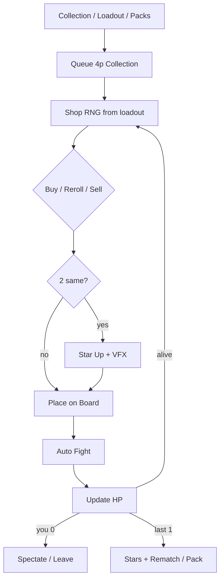

# Merge Arena — полный игровой процесс

> Working title: **Merge Arena**  
> DNA: **Clash Royale Merge Tactics** + **MLBB Magic Chess** (ускоренный) + **Collection/gacha** (HS / Nexus-like meta)  
> Не: TFT 25 мин · не: Anime TD · не: Drop Rush/Clash-hand  
> Связь: [[Merge Arena — Canon Lock]] · [[Merge Arena — Dual]]  
> Статус: desk detail · **если конфликт → Canon Lock** · Lock date 2026-08-07

---

## 0. Игра одной картинкой

```
COLLECTION / LOADOUT / PACKS
      ↓
ЛОББИ 4 ИГРОКА (Collection mode)
      ↓
РАУНД: Shop (RNG из LOADOUT) → купи / merge ★ → расставь
      ↓
AUTO FIGHT
      ↓
Урон по HP проигравшим
      ↓
LAST STANDING → Stars / pity crumbs → rematch / pack
```

**Чувство:** «собрал колоду → выпало в магазине → слил ★2 → доска снесла стол → ещё pack».  
**Soft launch завод:** collection + packs. **Fair Fixed ranked = 1.1+.**

Числа / SKU / palette / hard NO → **[[Merge Arena — Canon Lock]]** (не дублировать здесь вразрез).

---

## 1. Для кого и чем не является

| Это | Не это |
|---|---|
| Короткий **auto-battler** на 4 | Классические шахматы |
| Merge героев в сильнее (★) | Рука Clash Royale (Drop Rush) |
| Shop + позиция + автобой | Pure TD волны PvE-only |
| Ranked factory | Одноразовый steal-hit |

**Почему ниша «пустая» на Roblox:** есть слабые/не те игры; **нет** сочного Merge Tactics-класса с нормальным VFX и полным merge★.

---

## 2. Сервер и матч

| Param | MVP |
|---|---|
| Игроков в матче | **4** |
| Формат | FFA: у каждого **HP** (напр. 4–5 сердец); 0 HP = out |
| Длина матча | **6–10 мин** target (не 25) |
| Раунд | Prepare **12–18с** + Fight **15–25с** |
| Раундов | ~8–12 до конца типично |
| Камера | Top-down / лёгкий tilt, **mobile-first** |
| После матча | Rematch lobby / rank screen |

**4 игрока = темп:** стол схлопывается быстрее, чем у 8 в TFT.

Matchmaking: soft MMR / rank buckets (как Power bucket в других концептах).

---

## 3. Поле и юниты

### Поле (читаемое на телефоне)

```
[Тыл  — ranged / support]   3–4 слота
[Фронт — tank / melee]       3–4 слота
────────────────────────────────
Макс на поле: 6–8 юнитов (не hex-28)
```

- Drag-drop юнита из shop/bench на слот.  
- Крупные hitbox, без мелкой hex-сетки TFT.

### Юнит

| Поле | Смысл |
|---|---|
| `id` / имя / визуал | читаемый силуэт |
| `star` | ★1 → ★2 → ★3 |
| `cost` | 1–5 gold (shop tier) |
| `role` | tank / dps / support |
| `traits[]` | 1–2 тега синергии |
| `dps`, `hp`, skill | бой авто |

Billboard: имя · ★ · cost (в shop).

---

## 4. Merge ★ (ядро кайфа)

**Канон MVP (Clash Mini / Merge Tactics style):**

| Правило | |
|---|---|
| Вход | **2 одинаковых** юнита одного `id` и одной ★ |
| Результат | 1 юнит **★+1** (родители уходят) |
| Потолок | ★3 |
| Feel | **обязательный** жирный VFX + звук + camera punch |

```
★1 + ★1 → ★2
★2 + ★2 → ★3
```

Без сочного merge игра = «слабый Merge Tactics» → не шипить.

**Alt (TFT-style, v1.1):** 3 копии ★1 → ★2. Для MVP предпочтительнее **2→merge** (быстрее, читаемее).

Bench: до 6–8 юнитов «в запасе» (не на поле), тоже мерджатся.

---

## 5. Shop и экономика

> Числа reroll/gold → Canon Lock §3.

### Shop каждый prepare

| Param | Soft launch |
|---|---|
| Слотов | **3** |
| Источник RNG | **личный loadout (12)** — не общий fair pool |
| Reroll | **2 gold** flat |
| Buy / Sell | клик → bench/поле; sell % gold назад |

### Gold

| Источник | |
|---|---|
| Старт раунда | база + лёгкая прогрессия по раунду |
| Streak | лёгкий bonus |
| Interest | **OFF** (Canon Lock) |

Яма: не знаешь три слота → buy под merge / синергию / темп / reroll.  
Опциональность линий ограничена **loadout** — это фича Collection mode.

---

## 6. Синергии (lite)

| MVP | |
|---|---|
| Кол-во traits | **4–6** на весь ростер |
| Актив | 2 / 3 / 4 юнита с тегом (простые пороги) |
| UI | иконки под полем «Tank 2/3» |

Нет 20+ traits как TFT day-1.  
Синергия = бонус, **merge ★ = главный juice**.

---

## 7. Бой

1. Prepare закончился → юниты **сами** идут и бьют.  
2. Нет ручного каста skill (или 1 player-ability max в v2).  
3. Победил раунд = меньше урона по тебе / нанёс урон другим по правилам FFA.  

**FFA урон (простой канон):**
- Проиграл раунд → −1 HP (или −1/−2 от силы врага later).  
- Win streak cosmetic flex ok.

Когда HP = 0 → spectator до конца матча (или leave без penalty soft).

---

## 8. Core loop

### Внутри матча

```
Shop RNG(loadout) → Buy/Reroll → Merge ★ → Place
→ Auto fight → HP update → Next round
```

### Сессия

```
Loadout → Queue → Match 6–10 мин → Stars/pity → Rematch / Pack / Tweak deck
```

### Длинный завод

```
Collection + banners
→ New unit rows (Block Kit)
→ Fair Fixed ranked (1.1+)
→ Cosmetics boards / VFX
→ Cups / BP
```

---

## 9. Прогрессия аккаунта (между матчами)

| Система | Soft launch | Зачем |
|---|---|---|
| **Collection** | 12 core + 8 gacha | GROW + cash |
| **Loadout** | 12 из owned | skill + build identity |
| **Packs** | Unit Pack + Starter + pity | Roblox ARPU |
| **VIP / XP** | thin passes | fuel |
| **Rank stub** | MMR buckets + collection band | MM fairness |
| **Cosmetics factory** | later | flex |
| **Fair Fixed ranked** | BACKLOG 1.1+ | skill ladder |

**Закон редкости:** gacha ≠ +DPS. Редкость = другая линия синергии / identity.  
Дубликаты → dust/Stars, не permanent power.

---

## 10. Первые 90 секунд (tutorial + first match)

| t | Что | Цель |
|---|---|---|
| 0–15с | Dummy shop: купи 2 одинаковых | Verb buy |
| 15–30с | Стрелка **MERGE** → ★2 VFX | Wow merge |
| 30–45с | Поставь на фронт → auto fight win | Verb place + fight |
| 45–90с | Live 4p match starts (или bot fill) | Real loop |

Skip после 1 раза.  
Promise на thumb = **два юнита сливаются в ★ + взрыв боя**.

---

## 11. UI / mobile

| Элемент | |
|---|---|
| Shop bar | 3 крупные карточки снизу |
| Gold | крупно |
| Bench | ряд над shop |
| Board | 2 ряда слотов |
| Traits | strip иконок |
| HP rivals | 4 портрета с сердцами |
| Timer prepare | невозможно пропустить глазами |

**Закон:** всё тappable пальцем; никаких мелких hex.

---

## 12. Ranked, турниры, «билет в жизнь»

| Слой | Как |
|---|---|
| Ranked | каждый матч ± MMR; seasons 4–8 недель |
| Soft reset | новый season, keep cosmetics/roster progress partial |
| Tournament | weekend cup 8/16 bracket later |
| Expand | +unit, +trait, +map cosmetic, +mode — без смены фантазии |

**Почему factory:** контент = строки таблицы + баланс патч; удержание = рейтинг + meta chase.

---

## 13. Монетизация

> Полный канон SKU / фаз / запретов / валют → **[[Merge Arena — Canon Lock]] §5**.  
> Кратко soft launch: **Unit Pack + Starter Deck + VIP + 2× Stars**.  
> Collection loadout = канал ARPU. **Rarity ≠ DPS.** Fair Fixed ranked = 1.1+.

**Не продавать в матче:** shop odds, +bench, exclusive ★3, permanent +ATK от дубликатов.

**POI soft:** tutorial → Starter · first ★3 → Pack · 2nd match → Rematch+Pack.

**Пост-soft (BACKLOG):** boards / unique Merge VFX / BP / cups — после Go-gates + pack signal.

---

## 14. MVP ≤ systems (см. MVP_SLICE + Canon Lock)

Не дублировать список здесь вразрез с Lock. Источник правды: Canon Lock §3–§8 + `docs/MVP_SLICE.md`.

**НЕ в soft launch:** fair Fixed pool · interest deep · 8p · hex · 20 traits · cups live · board skin factory.

---

## 15. Flowchart



#gamedesign #merge-arena #auto-chess #merge-tactics #roblox
